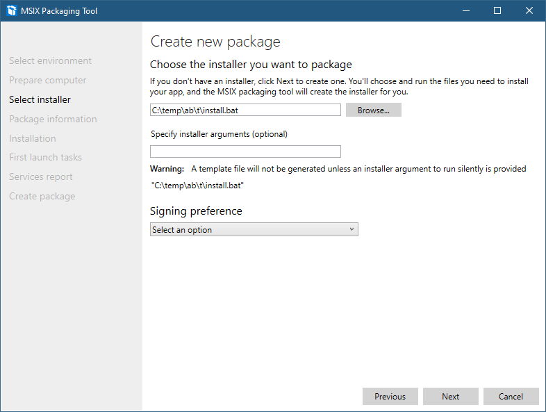
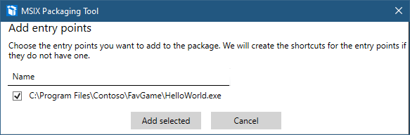
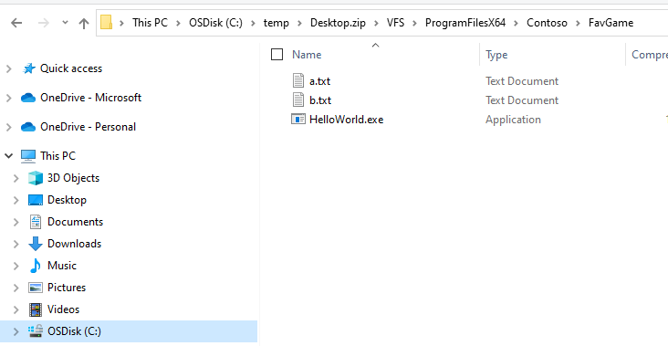
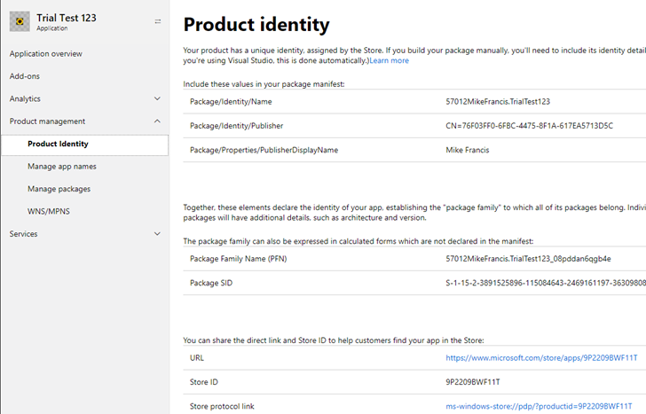

# XCOPY Install and MSIX Packaging Tool

The [MSIX Packaging Tool](https://www.microsoft.com/en-us/p/msix-packaging-tool/9n5lw3jbcxkf?activetab=pivot:overviewtab) can’t directly package a directory and it’s subfolders, however you can create a batch file that copies the files and serves as the installer for the ```MSIX Packaging Tool```. In addition to creating the MSIX package, the Packaging tool will create a template file which you can use to do these steps is an automated way by running the MSIX Package tool CLI passing the template file as an argument. (To create a template, the MSIX package tool requires an installer. The 'installer' in the context of this post is ```install.bat```.) More information here: <a href='https://docs.microsoft.com/en-us/windows/msix/packaging-tool/package-conversion-command-line'>Create a package using the command line interface - MSIX | Microsoft Docs</a>

```
root
|   install.bat
└───Files
    │   file1.txt
    │   file2.dll
    |   HelloWorld.exe
    │   ...
    └───Documents
        │   GettingStarted.doc
        │   ...
```

In this example, my game is in ‘Files’, with additions files in the 'Documents' folder.
The contents of install.bat is as follows:

```xcopy files "%programfiles%\Contoso\FavGame" /s /i /Y```

This batch file copies files in the 'Files' folder and the contents of it's subfolders. This are copied to C:\Program Files\Contoso\FavGame. 

To create the MSIX package, you will:
1) Point the ```MSIX Packaging Tool``` to ```INSTALL.BAT``` at the 'Choose the installer' prompt:



2) At the step **Create new package | Manage First Launch Tasks** you will need to specify the EXE that you want to launch. Click **Browse**.


At the **Add entry points** prompt, select the checkbox for the EXE that should be launched when the user starts the app.



Complete the remaining steps.

When the batch file ran, the **MSIX Packaging Tool**, it captured the file copy operation and packaged the files in the VFS folder of the MSIX file. Here is a screenshot of the MSIX created by the Packaging Tool: (temporary rename of msix to zip for File Explorer view)

 

Additionally, the Packaging Tool will create a template file which you can modify for subsequent games and only modify the title and assets specific to that game. Using the template you can convert the app using the command line instead of the Packaging Tool GUI.  [Create a package using the command line interface - MSIX | Microsoft Docs](https://docs.microsoft.com/en-us/windows/msix/packaging-tool/package-conversion-command-line)

Regarding the package information fields, here’s a screenshot of the identity page for my ```Trial Test 123``` app. The top values correspond to the following entries in the appxmanifest file.

Application ID(s): (Navigate to [Dashboard > App Name > Product Management > Product Identity]) For example:

 

Here are the corresponding values in appxmanifest.xml:

```<Identity ProcessorArchitecture="x86" Version="1.1.12.0" Publisher="CN=76F03FF0-6FBC-4475-8F1A-617EA5713D5C" Name=" 57012MikeFrancis.TrialTest123"/>```

